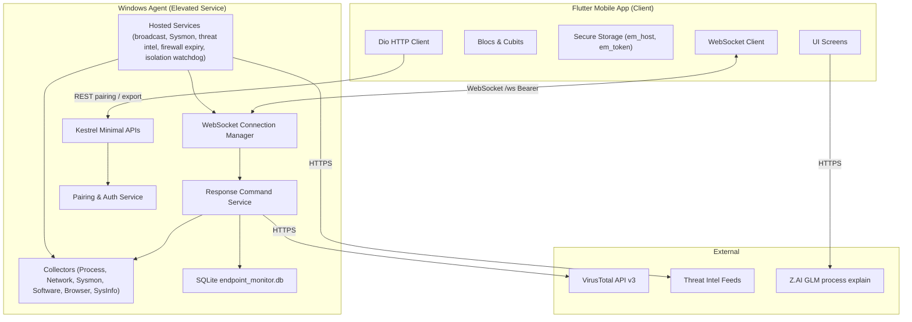

# AGENTS.md - Endpoint Monitor

Instructions for AI coding agents working in this repository. Human-oriented product docs, screenshots, and analyst playbooks live in [`README.md`](README.md).

---

## Project overview

Self-hosted EDR: a **Flutter** mobile client talks to an elevated **.NET 10** Windows agent over local network / VPN (REST + WebSocket). No cloud control plane.

| Piece | Location | Notes |
|-------|----------|--------|
| Flutter client | `flutter_app/` | Package `endpoint_monitor`; Dart SDK `^3.7` |
| Windows agent | `windows_service/` | `EndpointMonitorService.exe`; SCM name **`EndpointMonitor`** |
| Agent tests | `windows_service.Tests/` | xUnit |
| Flutter tests | `flutter_app/test/` | `flutter test` |
| Secure coding (source) | `secure-coding-standing-instructions.md` | Also mirrored in `.cursor/rules/secure-coding.mdc` |

**IDs:** Android `com.endpointmonitor.endpoint_monitor` · iOS/macOS `com.endpointmonitor.endpointMonitor` · SQLite `%LocalAppData%\EndpointMonitor\endpoint_monitor.db`

### Architecture (high level)



---

## Setup & run

### Prerequisites

- Flutter SDK (Dart `^3.7`)
- .NET 10 SDK
- Windows 10/11 x64; **Administrator** to run the agent (WMI, Sysmon, firewall, process actions)

### Windows agent

```bash
cd windows_service
cp appsettings.example.json appsettings.json   # or: copy on Windows CMD
# Set Auth:DeviceTokenPepper to 32+ random characters before pairing
dotnet run                                     # elevated shell
```

- Default listen port: `Server:Port` in `appsettings.json` (usually **5000**); optional HTTPS on `HttpsPort` (usually **5001**).
- Health: `GET http://localhost:<port>/health` → `{"ok":true}` (no auth).
- Pairing UI: desktop setup console (`Desktop/`) → **Pair**. Details: `windows_service/RUN.txt`, `windows_service/BUILD-SINGLE-EXE.md`.

### Flutter app

```bash
cd flutter_app
flutter pub get
flutter run
```

Tokens/host go in **`flutter_secure_storage`**, never plain prefs for secrets.

---

## Build & test

```bash
# Agent unit tests
dotnet test windows_service.Tests/EndpointMonitorService.Tests.csproj

# Flutter unit/widget tests
cd flutter_app && flutter test

# Static analysis (Flutter)
cd flutter_app && dart analyze
```

Before finishing a change that touches the area you edited: run the relevant test project(s) above. Prefer targeted tests over full-suite thrash when iterating; run the matching suite before claiming done.

Do **not** commit `windows_service/appsettings.json` secrets, device tokens, or real API keys. Use `appsettings.example.json` / env / local untracked config.

---

## Codebase map

### `windows_service/`

| Path | Responsibility |
|------|----------------|
| `Program.cs` | DI, middleware, REST mapping, service vs desktop-console launch |
| `Desktop/` | WPF setup console (Home, Pair, Devices, Diagnostics, Settings) + tray |
| `LocalConsoleApi.cs` | Loopback-only JSON for the desktop console |
| `Endpoints/` | HTTP endpoint registration helpers |
| `Collectors/` | Process, network, throughput, software, system info |
| `Hosted/` | Broadcast (~1s), Sysmon, threat intel, firewall expiry, isolation watchdog, system info |
| `Services/` | Pairing/auth, WebSocket manager, VT, threat intel, firewall isolation, GeoIP |
| `Commands/ResponseCommandService.cs` | EDR actions (kill, suspend, isolate, block, screenshot, power, …) |
| `Database/` | SQLite (`AppDatabase`, entities) - **parameterized / ORM only** |
| `Sysmon/` | Installer, XML parser, ingest |
| `Browser/`, `Alerts/` | Browser history / alert-related agent code |

### `flutter_app/lib/`

| Path | Responsibility |
|------|----------------|
| `main.dart`, `app.dart` | Entry + app shell |
| `app_router.dart` | `go_router`; unauthenticated → connect flow |
| `connect/` + `screens/connect_*.dart` | Wi-Fi / Tailscale connect + pairing |
| `bloc/` | Telemetry & feature state (`ConnectionBloc` fans out WS payloads) |
| `screens/` | Dashboard, processes, network, events, firewall, controls, more, … |
| `services/` | HTTP/WS clients, integrations |
| `task/` | Foreground/background WS keep-alive |
| `settings/` | App settings (non-secret prefs OK; tokens stay in secure storage) |

Human API/command tables: [`README.md`](README.md) (§ API & Command Specification).

---

## Conventions

1. **Telemetry loop** - Broadcast is ~**1 second**. New collectors must stay non-blocking and cheap per tick.
2. **SQL** - Parameterized queries / SQLite-net bindings in `AppDatabase.cs` only. No string-built SQL.
3. **Fail closed** - Auth, pairing, and dangerous commands deny on error; log detail server-side; generic client errors.
4. **Blocs** - Keep events/states in the same file as the Bloc/Cubit unless an existing split says otherwise.
5. **Secrets** - Pepper, VT keys, Z.AI keys, tokens: config/env/secure storage only. Never hardcode.
6. **EDR side effects** - Firewall isolation, process kill/suspend, and `netsh` rules are high-impact. Preserve rollback/watchdog behavior (`IsolationWatchdogHostedService`, allow-rule naming). Emergency local recovery steps are in [`README.md`](README.md).
7. **Scope** - Prefer small, task-focused diffs. Do not drive-by refactor unrelated areas.
8. **Docs** - Update `README.md` when user-visible behavior or public APIs change; keep this file focused on agent workflow and navigation.

---

## Security (must follow)

Standing rules: `secure-coding-standing-instructions.md` and `.cursor/rules/secure-coding.mdc`.

Highlights for this stack:

- Treat pairing codes, WS/REST payloads, process names, IPs, and Event Log XML as **untrusted**; validate before `netsh`, process APIs, or SQL.
- Re-check auth on the agent for every privileged action - UI checks are not enough.
- Device tokens: store only **SHA-256(token + pepper)** server-side; raw token once to the client → `flutter_secure_storage`.
- Security headers, optional IP allowlist, and rate limiting stay on by default; do not weaken them casually.
- External calls (VT, feeds, Z.AI): timeouts + defined failure behavior; no silent hangs.

### Auth / transport (quick reference)

1. Desktop console generates a short-lived 6-digit pairing code.
2. Client `POST /api/auth/pairing/complete` → opaque device token (once).
3. Client opens `/ws` with `Authorization: Bearer <token>`; agent validates hashed token via `AuthTokenValidator`.

---

## Where to look for common tasks

| Task | Start here |
|------|------------|
| New WS command / EDR action | `Commands/ResponseCommandService.cs` + matching Flutter bloc |
| Pairing / tokens | `Services/PairingAuthService.cs`, `AuthTokenValidator.cs`, Flutter connect + secure storage |
| Live process/network UI | `Hosted/MonitorBroadcastHostedService.cs`, `bloc/process_bloc.dart`, `bloc/network_bloc.dart` |
| Sysmon pipeline | `Sysmon/`, `Hosted/SysmonHostedService.cs` |
| Isolation / firewall | `Services/FirewallIsolation*.cs`, `Hosted/IsolationWatchdogHostedService.cs`, `bloc/firewall_bloc.dart` |
| Desktop setup UI | `Desktop/` |
| Threat intel / VT | `Services/ThreatIntelUpdater.cs`, `VirusTotalReputationService.cs` |

---

## Do not

- Commit secrets, real peppers, or production `appsettings.json` values.
- Bypass pairing/auth for “easier” local testing in committed code.
- Add dependencies without verifying the package name and pinning a version.
- Leave isolation or firewall changes without rollback / watchdog awareness.
- Duplicate large product marketing or screenshot galleries here - use `README.md`.
