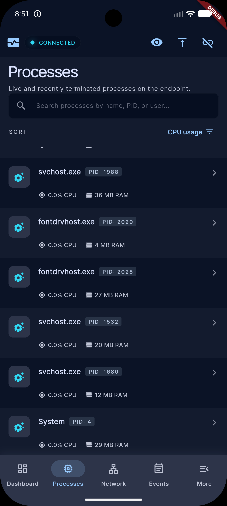
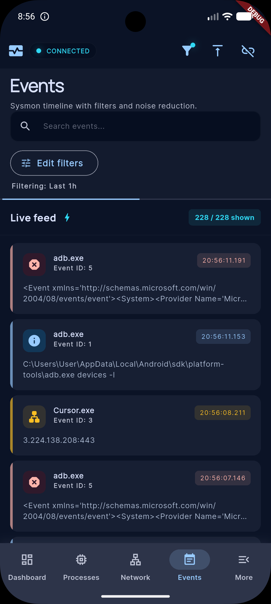

# Endpoint Monitor (EDR) — Self-Hosted Endpoint Detection, Response & Forensics Platform

[]()
[]()
[]()

**Endpoint Monitor** is a self-hosted, lightweight **Endpoint Detection and Response (EDR)** and digital forensics platform. It allows security analysts and administrators to monitor, audit, and remotely control a Windows host directly from a mobile device — without relying on a third-party cloud control plane.

The system consists of an elevated **C# .NET 10 Windows Service (Agent)** running on the monitored host and a **Flutter Mobile Application (Client)**. Communication occurs directly over local networks or VPNs via secure REST APIs and high-frequency WebSockets.

---

## Platform showcase

### Connection and pairing

Pair the mobile client to the Windows agent over LAN or VPN. Enter the agent address, then complete one-time pairing with a short-lived code from the system tray or the loopback-only pairing page on the PC.

**Enter agent address**


**Pair with code**


---

### Dashboard

After pairing, the dashboard streams live endpoint health: connection status, 24-hour activity, threat-intel coverage, process and connection counts, resource usage, system identity, Sysmon status, and host isolation controls.

**Activity, threat intel, and resource overview**


**System identity, Sysmon status, and host isolation**


---

### Processes

Browse live and recently terminated processes. Open any process for command line, parent PID, response actions (kill, suspend, resume, flag), VirusTotal lookup, and optional AI-assisted triage.

**Process list**



**Process detail and response actions**


**AI process explanation**


---

### Network

Monitor active sockets with threat-intel context, geo lookup, and bandwidth metrics. Drill into a connection to inspect endpoints, duration, and block or flag the remote IP.

**Active connections and threat intel**


**Connection detail and blocking**


---

### Firewall and host isolation

Manage machine isolation, quick outbound port blocks, and manual IP rules with direction and expiry options.

**Firewall overview and quick blocks**


**Manual IP block**


---

### Events

Review a live Sysmon timeline with search, filters, and noise reduction. Events include process creation, network connections, and process termination.



---

### More tools

Access browser history, installed software, alerts, firewall, remote controls, watchlist, and paired-device management from the More hub.


---

## 🛡️ Core SOC & EDR Capabilities

### 1. Real-Time Telemetry Streaming
- **Telemetry Loop**: The C# Agent broadcasts system health, process metrics, and active network connections every **1 second** over a stateful WebSocket connection.
- **State Management**: The Flutter client utilizes the **Bloc pattern** to parse high-frequency JSON payloads and update the UI smoothly without performance degradation.

### 2. Sysmon XML Ingestion Pipeline
- **Automated Setup**: The Agent contains an automated installer that deploys and configures **Microsoft System Monitor (Sysmon)** with a security-hardened configuration file.
- **Event Parsing**: Ingests and parses XML events from the `Microsoft-Windows-Sysmon/Operational` event log channel, extracting:
  - **Event ID 1 (Process Creation)**: Command lines, parent PIDs, and process names.
  - **Event ID 3 (Network Connection)**: Source/destination IPs, ports, and protocols.
  - **Event ID 22 (DNS Query)**: Query names and resolution status.
- **Forensic Timeline**: Normalizes and stores events in a local SQLite database, allowing analysts to search and export historical security logs.

### 3. Active Threat Containment
- **Host Network Isolation**: Instantly isolates the host from the network during a security incident. The Agent injects strict Windows Firewall rules (`netsh advfirewall`) blocking all inbound and outbound traffic, while explicitly allowing traffic on the Agent's port so the mobile app retains control.
- **Process Suspension/Resumption**: Suspends a suspicious process's execution threads using undocumented native NT APIs (`NtSuspendProcess` in `ntdll.dll`). This freezes malicious activity (e.g., ransomware encryption) without terminating the process, preserving volatile memory (RAM) for forensic dumping.
- **Process Tree Termination**: Terminates a malicious process and all of its child processes recursively to prevent evasion.
- **Dynamic Firewall Injection**: Blocks malicious IPs, outbound ports, or specific executable paths on-demand. Rules can be permanent or configured with a temporal expiry (e.g., block IP for 2 hours), which are automatically purged by a background worker.

### 4. Threat Intelligence & Reputation Lookups
- **VirusTotal Integration**: Queries the VirusTotal API v3 using the SHA-256 hash of any running process's executable to retrieve its global reputation and detection ratio.
- **Threat Intel Feeds**: Automatically polls public malicious IP blocklists (C2 nodes, botnets, spam sources) on a background thread, caching them in SQLite to highlight suspicious active connections instantly.

---

## 🏗️ Architecture & Security Design

```
+---------------------------------------------------------------------------------------+
|                                  FLUTTER MOBILE APP                                   |
|  - UI Screens (Dashboard, Processes, Network, Events, Controls, More)                 |
|  - Blocs (ConnectionBloc, ProcessBloc, NetworkBloc, EventsBloc, FirewallBloc)         |
|  - Secure Storage (em_host, em_token)                                                 |
+---------------------------------------------------------------------------------------+
                                           |
                                           |  (Direct LAN / VPN Connection)
                                           |  - REST APIs (Pairing, Log Export)
                                           |  - WebSockets (1s Telemetry & Commands)
                                           v
+---------------------------------------------------------------------------------------+
|                                WINDOWS AGENT SERVICE                                  |
|  - Kestrel Web Server (ASP.NET Core Minimal APIs / WebSockets)                        |
|  - SQLite Database (endpoint_monitor.db - Sysmon events, Device tokens, Audit logs)   |
|  - Background Hosted Services (Telemetry Broadcast, Sysmon Ingest, Threat Intel)      |
|  - Low-Level OS Integration (Win32 P/Invokes, WMI, Windows Firewall, Registry)        |
+---------------------------------------------------------------------------------------+
```

### 🔐 Zero-Trust Pairing Protocol
To prevent unauthorized access on shared local networks, the platform implements a secure pairing protocol:
1. **PIN Generation**: A temporary 6-digit pairing code is generated via the system tray or loopback-only local web page.
2. **Key Exchange**: The mobile client submits the code and its device name. Upon validation, the Agent generates a cryptographically secure random **Device Token**.
3. **Token Hashing**: The Agent hashes the token using **SHA-256** combined with a server-side secret pepper (`Auth:DeviceTokenPepper` from `appsettings.json`) and stores the hash in SQLite. The raw token is returned to the mobile app *once* and stored in its secure keychain/keystore.
4. **WebSocket Session**: Subsequent WebSocket connections pass the raw token in the `Authorization: Bearer <token>` header, which the Agent validates against the stored peppered hash.

---

## 💻 Tech Stack

- **Frontend (Mobile Client)**:
  - Framework: **Flutter (Dart ^3.5)**
  - State Management: **Bloc & Cubit**
  - Navigation: **go_router**
  - Networking: **Dio** & **web_socket_channel**
  - Storage: **flutter_secure_storage** & **shared_preferences**
- **Backend (Windows Agent)**:
  - Runtime: **.NET 10** (Windows Service)
  - Web Server: **Kestrel** (ASP.NET Core Minimal APIs)
  - Database: **SQLite** (via sqlite-net ORM)
  - OS Integration: **Win32 P/Invokes** (NtSuspendProcess, SendMonitorPowerOff), **WMI** (ManagementObjectSearcher), **Windows Firewall** (netsh)
  - Rate Limiting: **AspNetCoreRateLimit**
- **External Integrations**:
  - **VirusTotal API v3** (Reputation scanning)
  - **Groq API** (Process AI explanation)
  - **MaxMind GeoLite2** (IP geolocation)

---

## 📂 Repository Structure

```
endpoint-monitor/
├── flutter_app/                     # Flutter Mobile Application
│   ├── lib/
│   │   ├── bloc/                    # State management (Connection, Processes, Network, Events, etc.)
│   │   ├── screens/                 # UI Routes (Dashboard, Processes, Network, Events, More, etc.)
│   │   ├── widgets/                 # Shared UI components (PIN gate, branded app bar)
│   │   ├── task/                    # Background execution & WebSocket task handlers
│   │   ├── theme/                   # Material design theme configurations
│   │   ├── app.dart                 # Application entry and Bloc providers
│   │   └── app_router.dart          # Central routing configuration and redirect guards
│   └── pubspec.yaml                 # Flutter package dependencies
│
├── windows_service/                 # .NET 10 Windows Agent Service
│   ├── Program.cs                   # Composition root, DI, REST endpoints, and middleware
│   ├── Collectors/                  # Telemetry collectors (Process, Network, System Info)
│   ├── Hosted/                      # Background workers (Broadcast loop, Sysmon watcher, Threat Intel)
│   ├── Services/                    # Core business logic (Pairing, VirusTotal, GeoIP, WebSockets)
│   ├── Commands/                    # ResponseCommandService.cs (EDR response command orchestrator)
│   ├── Database/                    # SQLite database connection and table definitions
│   ├── Sysmon/                      # Sysmon auto-installer and XML event parser
│   ├── Alerts/                      # Alert engine for detecting suspicious activity
│   └── appsettings.example.json     # Configuration template
│
└── screenshots/                     # Platform UI screenshots
```

---

## 🚀 Quick Start Guide

### 1. Prerequisites
- **Flutter SDK** (Dart ^3.5)
- **.NET 10 SDK**
- **Windows 10/11 x64** (Administrator privileges are required to run the Agent for firewall and process controls)

### 2. Windows Agent Setup
1. Open an **elevated** PowerShell or Command Prompt (Run as Administrator).
2. Navigate to the agent directory:
   ```bash
   cd windows_service
   ```
3. Copy the configuration template:
   ```bash
   copy appsettings.example.json appsettings.json
   ```
4. Open `appsettings.json` and configure `Auth:DeviceTokenPepper` with a random string of 32+ characters.
5. Run the Agent:
   ```bash
   dotnet run
   ```

### 3. Mobile Client Setup
1. Navigate to the mobile app directory:
   ```bash
   cd flutter_app
   ```
2. Install dependencies:
   ```bash
   flutter pub get
   ```
3. Run the application on your device or emulator:
   ```bash
   flutter run
   ```

### 4. Pairing the App
1. On the monitored PC, generate a pairing code:
   - Click the system tray icon, or
   - Open a browser and visit `http://localhost:5000/local/pair` (only accessible from the local machine).
2. In the Flutter app, enter the Agent's IP address (e.g., `http://192.168.1.50:5000`) and the 6-digit pairing code.
3. Click **Connect** to establish the secure WebSocket session.

---

## 📖 SOC Analyst Playbooks & Use Cases

### Playbook 1: Containing a Ransomware Outbreak
* **Scenario**: A user reports that their files are changing extensions, indicating an active ransomware attack.
* **Response Action**:
  1. Open the **Processes** screen and identify the suspicious process (e.g., `unknown_encryptor.exe`).
  2. Click **Suspend Process**. This instantly freezes all threads of the process, halting the encryption loop.
  3. Navigate to the **Firewall Rules** screen and toggle **Isolate Machine**. This cuts off all inbound/outbound network connections, preventing the ransomware from spreading laterally across the corporate network or communicating with its C2 server.
  4. The host is now contained. The analyst can securely connect to the machine, dump the suspended process's memory for key extraction, and perform remediation.

### Playbook 2: Investigating a Suspicious Network Connection
* **Scenario**: The analyst receives an alert highlighting an active outbound connection to a red-flagged IP.
* **Response Action**:
  1. Open the **Network** screen. Locate the connection highlighted in red (indicating a match in the Threat Intel feed).
  2. Identify the source process associated with the socket (e.g., `powershell.exe`).
  3. Click on the process to open its detail view.
  4. Click **VirusTotal Scan** to check the reputation of the script or executable.
  5. Click **AI Explain** to receive a natural language breakdown of what the process is doing and why it might be executing PowerShell.
  6. Click **Block Network** to block that specific remote IP in the Windows Firewall, or click **Kill Process** to terminate the execution tree.

---

## 🔌 API & Command Specification

### REST API Endpoints

| Endpoint | Method | Auth Required | Description |
|----------|--------|---------------|-------------|
| `/health` | GET | No | Returns service status and version. |
| `/local/pair` | GET | Loopback Only | Generates and renders a temporary pairing code (HTML). |
| `/api/auth/pairing/complete` | POST | Pairing Code | Exchanges pairing code for an opaque device token. |
| `/export/events` | GET | Bearer Token | Exports historical Sysmon logs in JSON/CSV format. |

### WebSocket Commands (`/ws`)

The mobile client dispatches commands as JSON payloads over the WebSocket. The Agent processes them asynchronously via `ResponseCommandService`.

```json
// Example: Block IP Address
{
  "type": "block_ip",
  "ip": "185.220.101.5",
  "direction": "both",
  "expiresInHours": 24,
  "sourceProcess": "malicious_updater.exe"
}
```

| Command `type` | Payload Parameters | Action |
|----------------|--------------------|--------|
| `kill_process` | `{"pid": 1234}` | Terminates the process tree. |
| `suspend_process` | `{"pid": 1234}` | Suspends process execution threads. |
| `resume_process` | `{"pid": 1234}` | Resumes a suspended process. |
| `block_ip` | `{"ip": "x.x.x.x", "direction": "both", "expiresInHours": 2}` | Blocks an IP in the Windows Firewall. |
| `unblock_ip` | `{"ip": "x.x.x.x"}` | Removes an IP block rule. |
| `isolate_machine` | *None* | Blocks all network traffic except the Agent's port. |
| `unisolate_machine`| *None* | Restores normal network connectivity. |
| `block_process` | `{"name": "app.exe", "direction": "outbound"}` | Blocks an executable path from network access. |
| `capture_desktop_screenshot` | *None* | Captures and returns a base64 PNG of the desktop. |

---

## 🛡️ Secure Coding Practices Applied

1. **Input Validation & Sanitization**: All incoming commands, process names, and IP addresses are strictly validated against regular expressions and parsed safely to prevent command injection (e.g., netsh rule injection).
2. **Parameterized Queries**: All database interactions with SQLite utilize ORM parameter binding to prevent SQL injection.
3. **Fail-Closed Design**: On any internal exception or authentication failure, the Agent denies the request by default, logs the error server-side, and returns a generic error code to the client.
4. **Least Privilege**: The Agent runs as a Windows Service under the `LocalSystem` account to access low-level OS APIs, but restricts remote execution to validated, paired devices only.
