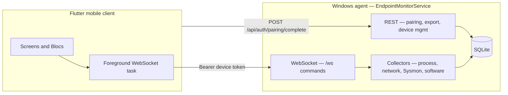

# Endpoint Monitor

Monitor and control a Windows PC from your phone. **Endpoint Monitor** pairs a **Flutter mobile client** with a **Windows endpoint agent** that runs as an ASP.NET Core Windows Service. The agent collects Sysmon-driven telemetry, network and process data, firewall state, browser history, and installed software; the mobile app connects over **WebSocket** for live views, alerts, and remote response actions.

There is no cloud control plane — you host the agent on the machine you want to monitor, typically on your LAN or VPN.

## Quick start

1. **Configure and run the Windows agent** (Administrator required):

   ```bash
   cd windows_service
   cp appsettings.example.json appsettings.json   # Windows: copy manually
   # Edit appsettings.json — set Auth:DeviceTokenPepper to a long random secret (32+ chars)
   dotnet run
   ```

2. **Pair your phone** — generate a pairing code from the agent's **system tray** icon, then enter the agent URL and code in the mobile app's **Connect** screen.

3. **Run the Flutter app**:

   ```bash
   cd flutter_app
   flutter pub get
   flutter run
   ```

After pairing, the app stores credentials in secure storage and opens a background WebSocket to the agent for live data and commands.

## Architecture



```
endpoint-monitor/
├── flutter_app/          # Cross-platform Flutter client (package: endpoint_monitor)
├── windows_service/      # EndpointMonitorService — HTTP + WebSocket + collectors + SQLite
├── tools/
│   └── NetworkTestProbe/ # Optional CLI for firewall/network testing
├── flutter_design/       # Static HTML mocks and design specs (not wired into the app)
└── AGENT_ONBOARDING.md   # Deep-dive for contributors and AI assistants
```

**Flutter layering:** `main.dart` → `app.dart` (Bloc providers, router) → `screens/` + `bloc/` + `widgets/`; WebSocket work runs in `task/` (foreground task handler).

**Windows layering:** `Program.cs` wires DI, HTTP/WebSocket maps, and SQLite init; domain logic lives under `Collectors/`, `Commands/`, `Hosted/`, `Services/`, `Alerts/`, `Sysmon/`, `Database/`, `Models/`.

## Features

### Mobile app

| Area | Capabilities |
|------|----------------|
| **Dashboard** | Connection status, activity heatmap, threat-intel summary, system identity |
| **Processes** | Live process list, detail view, watchlist flags, kill/suspend/resume, VirusTotal reputation |
| **Network** | Active connections, threat highlighting, connection detail, IP blocking |
| **Events** | Sysmon-style timeline with hour filtering |
| **More hub** | Browser history, installed software, alerts, firewall snapshot, endpoint controls, watchlist, settings |
| **Security UX** | Optional PIN unlock gate, light/dark theme (`ThemeCubit`) |
| **Background** | Foreground task keeps WebSocket alive; local push notifications for alerts |

The UI follows the **Cyber Slate** design system (`flutter_app/lib/theme/em_design_system.dart`), aligned with specs in `flutter_design/cyber_slate_console/DESIGN.md` — tonal layering, ghost edges, and high-density data presentation.

### Windows agent

| Area | Capabilities |
|------|----------------|
| **Telemetry** | Sysmon event ingestion, process/network collectors, throughput metrics, system info |
| **Intelligence** | Optional VirusTotal lookups, configurable threat-feed ingestion, GeoIP (MaxMind GeoLite2) |
| **Alerts** | Alert engine with acknowledgment over WebSocket |
| **Monitoring** | Installed-software change detection, firewall block expiry jobs |
| **Controls** | Process kill/suspend, IP/port/process firewall blocks, machine isolation, lock/logoff/restart/shutdown, volume, screenshot |
| **Exports** | Authenticated `GET /export/events` (JSON or CSV) |
| **Admin UI** | System tray for pairing codes and service status |

The agent requires **elevated privileges** on Windows for WMI, Sysmon interaction, firewall rules, and process controls.

## Stack

| Area | Technology |
|------|------------|
| Mobile app | Flutter 3.x (Dart ^3.5), Material 3 |
| Mobile state / routing | `flutter_bloc`, `go_router` |
| Mobile persistence | `flutter_secure_storage` (host + device token), `shared_preferences` (UI/settings) |
| Mobile background | `flutter_foreground_task` + local notifications |
| Windows agent | .NET 10 (`net10.0-windows`), minimal APIs, Windows Service + optional tray UI |
| Agent database | SQLite (`sqlite-net-pcl`) at `%LocalAppData%\EndpointMonitor\endpoint_monitor.db` |
| Agent HTTP | Kestrel; optional HTTPS via config |

## Authentication and pairing

1. The agent tray generates a **short-lived pairing code**.
2. The mobile app calls `POST /api/auth/pairing/complete` with the code and a device name.
3. The agent returns an **opaque device token**; only a peppered hash is stored server-side.
4. All subsequent WebSocket and REST calls use `Authorization: Bearer <device token>`.

Configure `Auth:DeviceTokenPepper` in `appsettings.json` (32+ characters). If pepper is omitted, `Auth:JwtSigningKey` acts as a legacy pepper fallback — see `windows_service/Options/AuthOptions.cs`.

Paired devices can be listed and revoked via `GET /api/auth/devices` and `POST /api/auth/devices/revoke`.

## WebSocket commands

The mobile client sends JSON messages over `/ws`. Command types handled by `ResponseCommandService` include:

`kill_process`, `block_ip`, `unblock_ip`, `isolate_machine`, `unisolate_machine`, `suspend_process`, `resume_process`, `flag_process`, `unflag_process`, `get_browser_history`, `get_installed_software`, `uninstall_software`, `get_recent_events`, `ack_alert`, `get_firewall_snapshot`, `get_flagged_processes`, `block_outbound_port`, `block_process`, `unblock_process`, `get_timeline`, `check_reputation`, `get_threat_intel_status`, `get_threat_intel_entries`, `get_system_info`, `refresh_threat_intel`, `lock_screen`, `logoff_user`, `restart_machine`, `shutdown_machine`, `sleep_machine`, `cancel_shutdown`, `turn_off_display`, `set_volume`, `toggle_mute`, `capture_desktop_screenshot`

`Program.cs` also handles `ping` / `pong` on the WebSocket.

## Prerequisites

- **Flutter SDK** compatible with `flutter_app/pubspec.yaml` (Dart ^3.5)
- **.NET 10 SDK** (matches `windows_service/EndpointMonitorService.csproj`)
- **Windows x64** for the agent (adjust publish `-r` for other architectures)
- **Administrator** shell to run or install the agent interactively

## Run — Windows agent

1. Copy `windows_service/appsettings.example.json` → `appsettings.json` (gitignored).
2. Set **`Auth:DeviceTokenPepper`** to a long random secret.
3. Run from an **elevated** shell:

   ```bash
   cd windows_service && dotnet run
   ```

4. Default HTTP port: **`Server:Port`** (example: `5000`). Optional HTTPS: `Server:UseHttps` / `Server:HttpsPort`.
5. Generate a pairing code from the **system tray**, then complete pairing in the mobile app.

Additional docs: `windows_service/RUN.txt`, `windows_service/BUILD-SINGLE-EXE.md`.

### Configuration reference

| Key | Purpose |
|-----|---------|
| `Auth:DeviceTokenPepper` | Peppers stored device-token hashes (primary) |
| `Auth:JwtSigningKey` | Legacy pepper if `DeviceTokenPepper` is empty |
| `VirusTotal:ApiKey` | Optional VirusTotal reputation calls |
| `ThreatIntel:Enabled` / `ThreatIntel:Feeds` | Threat-intel feed ingestion |
| `SoftwareMonitoring:Enabled` | Installed-software change alerts |
| `AllowedIpAddresses` | Optional allowlist for `/ws` clients |
| `IpRateLimiting` | Rate limits (e.g. pairing endpoint) |

Never commit real secrets. Use `appsettings.json` locally or .NET user secrets (`UserSecretsId` in the `.csproj`).

### Optional GeoIP

Download **GeoLite2-City.mmdb** from MaxMind (license required) and place it in `windows_service/` — the build copies it next to the published exe. See `windows_service/PLACE_GEOLITE2_DB_HERE.txt`.

## Run — Flutter app

```bash
cd flutter_app
flutter pub get
flutter run
```

Use platform targets as usual (`-d windows`, `-d chrome`, device IDs, etc.). The app expects a reachable agent URL for HTTP (pairing, REST) and WebSocket — configured via Connect / Settings (`em_host`, `em_token` in secure storage).

> **Note:** `flutter_app/pubspec.lock` is gitignored. Run `flutter pub get` after clone so dependency versions resolve consistently.

### Mobile route map

| Route | Screen |
|-------|--------|
| `/connect` | Pairing and host entry |
| `/dashboard`, `/processes`, `/network`, `/events`, `/more` | Bottom navigation shell |
| `/processes/:pid` | Process detail (`?ghost=1` for killed-process snapshot) |
| `/network/detail` | Connection detail (requires `NetworkConnection` in route extra) |
| `/browser`, `/software`, `/alerts`, `/firewall`, `/controls`, `/watchlist`, `/settings` | Pushed from More |

## Test and lint

| Component | Command |
|-----------|---------|
| Flutter analyze | `cd flutter_app && flutter analyze` |
| Flutter tests | `cd flutter_app && flutter test` |
| Windows agent build | `cd windows_service && dotnet build` |
| Network probe build | `cd tools/NetworkTestProbe && dotnet build` |

There is no automated test suite for the C# service in this repository.

## Release and deployment

**Agent:** See `windows_service/BUILD-SINGLE-EXE.md` for `dotnet publish` (self-contained single-file `EndpointMonitorService.exe`), Windows Service registration (`sc create EndpointMonitor`), and UAC behavior (`app.manifest`).

**Mobile:** Standard Flutter build pipelines (`flutter build apk`, `flutter build ipa`, etc.).

| Platform | Identifier |
|----------|------------|
| Android | `com.endpointmonitor.endpoint_monitor` |
| iOS / macOS | `com.endpointmonitor.endpointMonitor` |

## Observability

No third-party analytics or APM SDKs are integrated. The agent uses **Microsoft.Extensions.Logging** (console, Windows Event Log when run as a service, etc.). Mobile notifications are local (`flutter_local_notifications`) driven by app logic.

## Contributing and docs

| Document | Description |
|----------|-------------|
| [AGENT_ONBOARDING.md](./AGENT_ONBOARDING.md) | Route map, persistence, WebSocket types, and conventions for contributors |
| `windows_service/RUN.txt` | Short agent run checklist |
| `windows_service/BUILD-SINGLE-EXE.md` | Publish and Windows Service install |
| `flutter_design/cyber_slate_console/DESIGN.md` | UI design system specification |

## License

No license file is present in this repository. Add one before distributing or open-sourcing.
