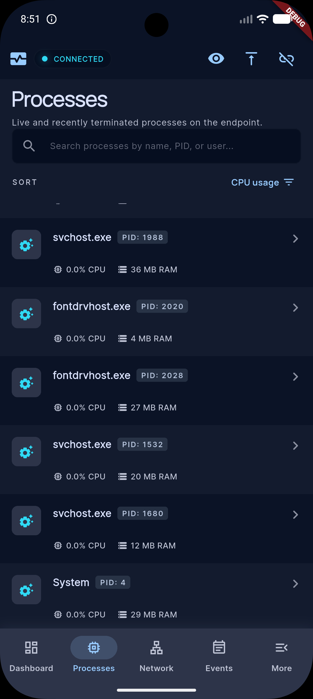
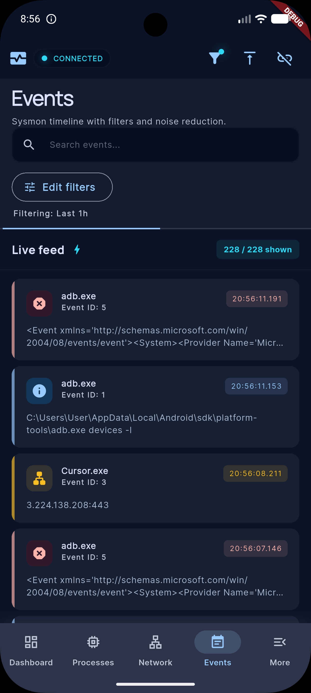

# Endpoint Monitor (EDR) - Self-Hosted Endpoint Detection, Response & Forensics Platform

[]()
[]()
[]()

**Endpoint Monitor** is a self-hosted, lightweight **Endpoint Detection and Response (EDR)** and digital forensics platform. It allows security analysts and administrators to monitor, audit, and remotely control a Windows host directly from a mobile device - without relying on a third-party cloud control plane.

The system consists of an elevated **C# .NET 10 Windows agent** (Kestrel + optional Windows Service) with a local **WPF desktop console** for pairing and ops, plus a **Flutter mobile client**. Communication runs over LAN or VPN (e.g. Tailscale) via secure REST APIs and a WebSocket for live telemetry and commands.

---

## 📸 Platform Showcase

### 1. Authentication & Dashboard
Establish a secure session using the Zero-Trust pairing protocol. Once connected, the Dashboard provides real-time visibility into the endpoint's health, CPU/RAM utilization, and active socket counts.

| Secure Pairing (Address) | Secure Pairing (Code) |
| :---: | :---: |
|  |  |

| Live Dashboard (Metrics) | Live Dashboard (System Info) |
| :---: | :---: |
|  |  |

---

### 2. Process Inventory & Forensic Analysis
Audit running processes in real-time. Select any process to view its parent-child relationship, executable path, resource utilization charts, query its hash reputation on **VirusTotal**, or generate an **AI Explanation** of its behavior.

| Process Inventory | Process Detail & Actions | AI Process Explanation |
| :---: | :---: | :---: |
|  |  |  |

---

### 3. Network Telemetry & Active Firewall Controls
Monitor active TCP/UDP connections. Remote IPs are cross-referenced in real-time against threat intelligence feeds, highlighting malicious connections in red. Analysts can block specific IPs, outbound ports, or restrict network access for specific executable paths.

| Active Network Connections | Connection Details |
| :---: | :---: |
|  |  |

| Firewall Rules & Isolation | Manual IP & Port Blocking |
| :---: | :---: |
|  |  |

---

### 4. Forensic Auditing & Remote Host Controls
Inspect ingested Sysmon logs, audit browser history across multiple profiles, and inventory installed software (with remote uninstallation capabilities). The platform also supports remote power management, volume controls, and real-time desktop screenshots.

| Sysmon Events Timeline | Additional Security Tools |
| :---: | :---: |
|  |  |

---

## 🛡️ Core SOC & EDR Capabilities

### 1. Real-Time Telemetry Streaming
- **Telemetry Loop**: The agent broadcasts system health, process metrics, and active network connections over a stateful WebSocket. Intervals are configurable under `Monitoring` in `appsettings.json` (example defaults: **5s** active broadcast, **30s** idle, **10s** system info; active interval is clamped 2–120s).
- **State Management**: The Flutter client uses the **Bloc/Cubit** pattern to parse JSON payloads and update the UI without jank.

### 2. Sysmon XML Ingestion Pipeline
- **Automated Setup**: The Agent contains an automated installer that deploys and configures **Microsoft System Monitor (Sysmon)** with a security-hardened configuration file.
- **Event Parsing**: Ingests and parses XML events from the `Microsoft-Windows-Sysmon/Operational` event log channel, extracting:
  - **Event ID 1 (Process Creation)**: Command lines, parent PIDs, and process names.
  - **Event ID 3 (Network Connection)**: Source/destination IPs, ports, and protocols.
  - **Event ID 22 (DNS Query)**: Query names and resolution status.
- **Forensic Timeline**: Normalizes and stores events in a local SQLite database, allowing analysts to search and export historical security logs.

### 3. Active Threat Containment
- **Host Network Isolation**: Instantly isolates the host from the network during a security incident. The Agent injects strict Windows Firewall rules (`netsh advfirewall`) blocking all inbound and outbound traffic, while explicitly allowing traffic on the Agent's port so the mobile app retains control.
- **Process Suspension/Resumption**: Suspends a suspicious process's execution threads using undocumented native NT APIs (`NtSuspendProcess` in `ntdll.dll`). This freezes malicious activity (e.g., ransomware encryption) without terminating the process, preserving volatile memory (RAM) for forensic dumping.
- **Process Tree Termination**: Terminates a malicious process and all of its child processes recursively to prevent evasion.
- **Dynamic Firewall Injection**: Blocks malicious IPs, outbound ports, or specific executable paths on-demand. Rules can be permanent or configured with a temporal expiry (e.g., block IP for 2 hours), which are automatically purged by a background worker.

### 4. Threat Intelligence & Reputation Lookups
- **VirusTotal Integration**: Queries the VirusTotal API v3 using the SHA-256 hash of any running process's executable to retrieve its global reputation and detection ratio.
- **Threat Intel Feeds**: Automatically polls public malicious IP blocklists (C2 nodes, botnets, spam sources) on a background thread, caching them in SQLite to highlight suspicious active connections instantly.
- **GeoIP**: Optional MaxMind GeoLite2 lookup for remote connection geography.

### 5. Forensics, Inventory & Host Controls
- **Browser history** across common Chromium/Firefox-style profiles; **installed software** inventory with optional new-install alerts and remote uninstall.
- **Watchlist / process flags** and **alert acknowledgements** driven by the agent's alert engine (e.g. bad-IP connections, flagged process starts).
- **Remote host controls**: lock, logoff, restart/shutdown (with cancel), sleep, display off, volume/mute, and desktop screenshot over the WebSocket.

---

## 🏗️ Architecture & Security Design

```
+---------------------------------------------------------------------------------------+
|                                  FLUTTER MOBILE APP                                   |
|  - Screens (Dashboard, Processes, Network, Events, Firewall, Controls, More, …)       |
|  - Blocs/Cubits (Connection, Process, Network, Events, Firewall, Alerts, …)           |
|  - Secure storage (em_host, em_token) · guided Wi-Fi / Tailscale / QR connect          |
+---------------------------------------------------------------------------------------+
                                           |
                                           |  LAN / VPN (e.g. Tailscale)
                                           |  - REST (pairing, devices, Sysmon export)
                                           |  - WebSocket /ws (telemetry + commands)
                                           v
+---------------------------------------------------------------------------------------+
|                         WINDOWS AGENT (.NET 10 / Kestrel)                             |
|  - Minimal APIs + /ws · SQLite (%LocalAppData%\EndpointMonitor\endpoint_monitor.db)   |
|  - Hosted workers (broadcast, Sysmon, threat intel, firewall expiry, isolation)       |
|  - Win32 / WMI / Firewall / Registry / Event Log                                      |
|  - WPF desktop console (loopback /local/*): Pair, Devices, Diagnostics, Settings      |
+---------------------------------------------------------------------------------------+
```

### 🔐 Zero-Trust Pairing Protocol
To prevent unauthorized access on shared local networks, the platform implements a secure pairing protocol:
1. **PIN Generation**: A temporary 6-digit pairing code (and optional QR payload) is generated in the Windows desktop console (**Pair** screen).
2. **Key Exchange**: The mobile client submits the code and its device name. Upon validation, the Agent generates a cryptographically secure random **Device Token**.
3. **Token Hashing**: The Agent hashes the token using **SHA-256** combined with a server-side secret pepper (`Auth:DeviceTokenPepper` from `appsettings.json`) and stores the hash in SQLite. The raw token is returned to the mobile app *once* and stored in its secure keychain/keystore.
4. **WebSocket Session**: Subsequent WebSocket connections pass the raw token in the `Authorization: Bearer <token>` header, which the Agent validates against the stored peppered hash.

---

## 💻 Tech Stack

- **Frontend (Mobile Client)**:
  - Framework: **Flutter (Dart ^3.7)**
  - State Management: **Bloc & Cubit**
  - Navigation: **go_router**
  - Networking: **Dio** & **web_socket_channel**
  - Storage: **flutter_secure_storage** (tokens) & **shared_preferences** (non-secrets)
  - Other: foreground task, local notifications, mobile QR scanner
- **Backend (Windows Agent)**:
  - Runtime: **.NET 10** (`net10.0-windows`) — Windows Service and/or interactive host
  - UI: **WPF** desktop console (Pair, Devices, Diagnostics, Settings)
  - Web Server: **Kestrel** (ASP.NET Core Minimal APIs)
  - Database: **SQLite** (sqlite-net) at `%LocalAppData%\EndpointMonitor\endpoint_monitor.db`
  - OS Integration: **Win32 P/Invokes** (e.g. `NtSuspendProcess`), **WMI**, **Windows Firewall** (`netsh`)
  - Hardening: **AspNetCoreRateLimit**, security headers, optional `AllowedIpAddresses`
- **External Integrations**:
  - **VirusTotal API v3** (Reputation scanning; key in agent `appsettings`)
  - **Z.AI GLM** (Process AI explanation; client-side)
  - **MaxMind GeoLite2** (IP geolocation)
  - Threat feeds (e.g. Abuse.ch Feodo, Emerging Threats) via agent config

Default agent ports: HTTP **5000**, optional HTTPS **5001** (`Server` section).

---

## 📂 Repository Structure

```
endpoint-monitor/
├── README.md                        # Product docs, quick start, playbooks
├── AGENTS.md                        # Instructions for coding agents
├── Program Summary[2026-10-09].md   # Full project snapshot
├── secure-coding-standing-instructions.md
├── flutter_app/                     # Flutter mobile client
│   ├── lib/
│   │   ├── bloc/                    # Connection, processes, network, events, firewall, …
│   │   ├── connect/                 # Guided Wi-Fi / Tailscale / QR pairing flow
│   │   ├── screens/                 # Dashboard, Processes, Network, Events, More, …
│   │   ├── widgets/                 # Shared UI (PIN gate, branded app bar, …)
│   │   ├── task/                    # Foreground task / WebSocket keep-alive
│   │   ├── app.dart / app_router.dart
│   │   └── …
│   ├── test/                        # Dart unit/widget tests
│   └── pubspec.yaml
├── windows_service/                 # .NET 10 agent + WPF desktop console
│   ├── Program.cs                   # DI, Kestrel, REST, /ws, middleware
│   ├── Desktop/                     # WPF Pair / Devices / Diagnostics / Settings
│   ├── Collectors/ · Hosted/ · Services/ · Commands/
│   ├── Database/ · Sysmon/ · Browser/ · Alerts/
│   ├── LocalConsoleApi.cs           # Loopback /local/* for the desktop UI
│   ├── appsettings.example.json
│   ├── BUILD-SINGLE-EXE.md          # Publish + Windows Service install
│   └── RUN.txt
├── windows_service.Tests/           # xUnit tests for the agent
├── flutter_design/                  # Design references
├── docs/superpowers/                # Specs / plans
├── tools/                           # Helper projects (e.g. NetworkTestProbe)
└── screenshots/                     # README showcase images
```

---

## 🚀 Quick Start Guide

### 1. Prerequisites
- **Flutter SDK** (Dart ^3.7)
- **.NET 10 SDK**
- **Windows 10/11 x64** (Administrator privileges are required for firewall, Sysmon, and process controls)

### 2. Windows Agent Setup
1. Open an **elevated** PowerShell or Command Prompt (Run as Administrator).
2. Navigate to the agent directory:
   ```bash
   cd windows_service
   ```
3. Copy the configuration template:
   ```bash
   copy appsettings.example.json appsettings.json
   ```
4. Open `appsettings.json` and set `Auth:DeviceTokenPepper` to a random string of **32+ characters**. Optionally set `VirusTotal:ApiKey` and place a GeoLite2 DB beside the exe if you use GeoIP.
5. Run the agent (starts Kestrel and opens the desktop console in typical interactive launches):
   ```bash
   dotnet run
   ```
6. Confirm health: `GET http://localhost:5000/health` should report OK.

For a **single-file publish** and installing the Windows Service named **`EndpointMonitor`**, see [`windows_service/BUILD-SINGLE-EXE.md`](windows_service/BUILD-SINGLE-EXE.md). You can also enable **Start with Windows (Windows Service)** from the desktop console **Settings** page.

### 3. Mobile Client Setup
1. Navigate to the mobile app directory:
   ```bash
   cd flutter_app
   ```
2. Install dependencies:
   ```bash
   flutter pub get
   ```
3. Run the application on your device or emulator:
   ```bash
   flutter run
   ```

### 4. Pairing the App

Open the Flutter app and choose how the phone reaches the PC:

**Same Wi-Fi (local)**
1. On the monitored PC, open the **Endpoint Monitor** desktop app → **Pair** and copy the Wi-Fi address and 6-digit code (or scan the QR where supported).
2. In the app, tap **This Wi-Fi**, enter that address (e.g. `192.168.1.50` or `192.168.1.50:5000`) and the 6-digit code, then tap **Connect**.

**Away from home (Tailscale)**
1. Install [Tailscale](https://tailscale.com/download) on the PC and phone; sign in with the **same account** on both.
2. On the PC, copy the Tailscale IP (starts with `100.`) or MagicDNS name (`my-pc.ts.net`) from the Tailscale app.
3. On the PC, open the Endpoint Monitor desktop app → **Pair** for the pairing code.
4. In the app, tap **Away from home**, paste the Tailscale address and code, then tap **Connect**.

If this phone was paired before, use **Continue to …** on the connect screen or enter the saved address again. To change setup paths, use **Set up connection again** in Settings → CONNECTION.

---

## 📖 SOC Analyst Playbooks & Use Cases

### Playbook 1: Containing a Ransomware Outbreak
* **Scenario**: A user reports that their files are changing extensions, indicating an active ransomware attack.
* **Response Action**:
  1. Open the **Processes** screen and identify the suspicious process (e.g., `unknown_encryptor.exe`).
  2. Click **Suspend Process**. This instantly freezes all threads of the process, halting the encryption loop.
  3. Navigate to the **Firewall Rules** screen and toggle **Isolate Machine**. This cuts off all inbound/outbound network connections, preventing the ransomware from spreading laterally across the corporate network or communicating with its C2 server.
  4. The host is now contained. The analyst can securely connect to the machine, dump the suspended process's memory for key extraction, and perform remediation.

### Playbook 2: Investigating a Suspicious Network Connection
* **Scenario**: The analyst receives an alert highlighting an active outbound connection to a red-flagged IP.
* **Response Action**:
  1. Open the **Network** screen. Locate the connection highlighted in red (indicating a match in the Threat Intel feed).
  2. Identify the source process associated with the socket (e.g., `powershell.exe`).
  3. Click on the process to open its detail view.
  4. Click **VirusTotal Scan** to check the reputation of the script or executable.
  5. Click **AI Explain** to receive a natural language breakdown of what the process is doing and why it might be executing PowerShell.
  6. Click **Block Network** to block that specific remote IP in the Windows Firewall, or click **Kill Process** to terminate the execution tree.

---

## 🔌 API & Command Specification

### REST API Endpoints

| Endpoint | Method | Auth Required | Description |
|----------|--------|---------------|-------------|
| `/health` | GET | No | Returns service status and version. |
| `/local/status` | GET | Loopback only | Agent health snapshot for the desktop console. |
| `/local/pairing` | GET | Loopback only | JSON pairing code / QR payload for the desktop console. |
| `/local/devices` | GET | Loopback only | Lists paired mobile devices (no token hashes). |
| `/local/devices/revoke` | POST | Loopback only | Revokes a paired device by id. |
| `/api/auth/pairing/complete` | POST | Pairing code | Exchanges pairing code for an opaque device token. |
| `/api/auth/devices` | GET | Bearer token | Lists paired devices for the authenticated client. |
| `/api/auth/devices/revoke` | POST | Bearer token | Revokes a paired device by id. |
| `/export/events` | GET | Bearer token | Exports historical Sysmon logs (`from` / `to` / `format` JSON|CSV). |

### WebSocket Commands (`/ws`)

The mobile client dispatches commands as JSON payloads over the WebSocket. The agent handles them in `ResponseCommandService`. Telemetry and alerts are server-pushed message types (e.g. `telemetry`, `alert`), not the command switch below.

```json
// Example: Block IP Address
{
  "type": "block_ip",
  "ip": "185.220.101.5",
  "direction": "both",
  "expiresInHours": 24,
  "sourceProcess": "malicious_updater.exe"
}
```

| Category | Command `type` values |
|----------|------------------------|
| Process / watchlist | `kill_process`, `suspend_process`, `resume_process`, `flag_process`, `unflag_process`, `get_flagged_processes` |
| Firewall / isolation | `block_ip`, `unblock_ip`, `block_outbound_port`, `block_process`, `unblock_process`, `isolate_machine`, `unisolate_machine`, `get_firewall_snapshot` |
| Intel / reputation | `check_reputation`, `get_threat_intel_status`, `get_threat_intel_entries`, `refresh_threat_intel` |
| Forensics / inventory | `get_recent_events`, `get_browser_history`, `get_installed_software`, `uninstall_software`, `ack_alert`, `get_system_info` |
| Host controls | `lock_screen`, `logoff_user`, `restart_machine`, `shutdown_machine`, `sleep_machine`, `cancel_shutdown`, `turn_off_display`, `set_volume`, `toggle_mute`, `capture_desktop_screenshot` |

Common payloads: `kill_process` / `suspend_process` / `resume_process` use `{"pid": 1234}`; `block_ip` uses `ip`, optional `direction` / `expiresInHours` / `port`; `block_process` uses `name` + optional `direction`. **`isolate_machine`** applies default-deny firewall profiles with scoped allows for the agent; it **auto-unisolates after ~90s** if no authenticated WebSocket client remains. **`unisolate_machine`** restores saved policies.

---

## Emergency recovery: machine isolation

If **Isolate Machine** was used and the Flutter app can no longer reach the Windows agent, recovery requires **local access** to the PC (physical keyboard, iDRAC/IPMI, or hypervisor console - not the phone app).

Run in an **elevated Command Prompt**:

```bat
netsh advfirewall set allprofiles firewallpolicy blockinbound,allowoutbound
netsh advfirewall firewall delete rule name="EM_ISOLATE_ALLOW_MONITOR_IN"
netsh advfirewall firewall delete rule name="EM_ISOLATE_ALLOW_MONITOR_OUT"
netsh advfirewall firewall delete rule name="EM_ISOLATE_BLOCK_IN"
netsh advfirewall firewall delete rule name="EM_ISOLATE_BLOCK_OUT"
netsh advfirewall firewall delete rule name="EM_ISOLATE_ALLOW_MONITOR"
netsh advfirewall firewall delete rule name="EM_ISOLATE_ALLOW_MONITOR_OUT"
```

Then reconnect the app and tap **Unisolate Machine** on the Firewall screen so the agent SQLite state matches the live firewall.

**Manual verification:** isolate while the app stays connected → browsing stops but the app remains connected → unisolate restores normal traffic. Isolate with the phone disconnected → network should return within ~90 seconds automatically.

---

## 🛡️ Secure Coding Practices Applied

1. **Input Validation & Sanitization**: All incoming commands, process names, and IP addresses are strictly validated against regular expressions and parsed safely to prevent command injection (e.g., netsh rule injection).
2. **Parameterized Queries**: All database interactions with SQLite utilize ORM parameter binding to prevent SQL injection.
3. **Fail-Closed Design**: On any internal exception or authentication failure, the Agent denies the request by default, logs the error server-side, and returns a generic error code to the client.
4. **Least Privilege**: The Agent runs as a Windows Service under the `LocalSystem` account to access low-level OS APIs, but restricts remote execution to validated, paired devices only.

---

## 📄 Context

This repository demonstrates secure client-server architectures, low-level systems code in C#, Windows internals integration, and a real-time Flutter security client.

- Day-to-day product docs: this `README.md`
- Full project snapshot (features, data model, ops): [`Program Summary[2026-10-09].md`](Program%20Summary%5B2026-10-09%5D.md)
- Agent working instructions: [`AGENTS.md`](AGENTS.md)
- Secure coding standing rules: [`secure-coding-standing-instructions.md`](secure-coding-standing-instructions.md)
